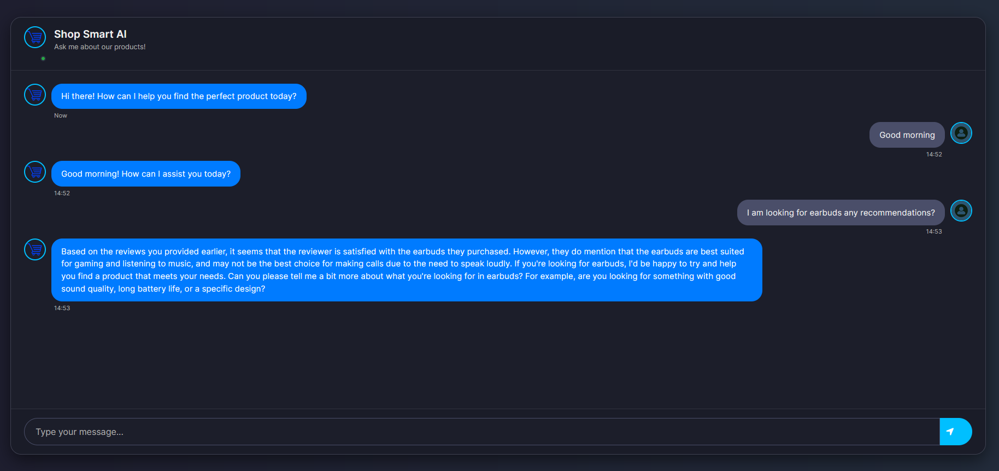

# 🛍️ Shop Smart AI Recommender - LLMOps Project

Welcome to the **Shop Smart AI Recommender**! This project showcases a complete, end-to-end LLMOps pipeline for a conversational AI application. The system provides intelligent product recommendations based on real customer reviews, all wrapped in a modern, cloud-native architecture.

---

### 🚀 Project Overview

This application provides intelligent product recommendations using a Retrieval-Augmented Generation (RAG) architecture. It demonstrates:

-   **Local Development**: Building a robust Python application with a clear, modular structure.
-   **Containerization**: Packaging the application and its dependencies using Docker for portability.
-   **Cloud Deployment**: Orchestrating the entire application stack on a Google Cloud VM using Kubernetes (Minikube).
-   **Secure Configuration**: Managing secrets and API keys safely with Kubernetes Secrets.
-   **Real-time Monitoring**: Observing application health and performance with Prometheus and Grafana.
-   **CI/CD Ready**: A clean project structure ready for future automation workflows.

---

### 🛠️ Tech Stack

| Tool                      | Purpose                                              |
| ------------------------- | ---------------------------------------------------- |
| **Python** | Core application development                         |
| **LangChain** | Framework for building the RAG chain                 |
| **Groq & Hugging Face** | LLM and embedding models                             |
| **Flask** | Web framework for the backend API                    |
| **Astra DB** | Cloud-native vector database                         |
| **Docker** | Containerization                                     |
| **Kubernetes (Minikube)** | Orchestration and deployment                         |
| **GCP** | Infrastructure hosting                               |
| **Prometheus & Grafana** | Observability and monitoring                       |

---

### 🖼️ Screenshots

Here is a snapshot of the deployed Shop Smart AI Recommender in action:



---

### 📂 Project Structure

```
.
├── assets/                 # Project images and screenshots
│   └── shop_smart_ai_pic2.png
├── chain/                  # Core RAG chain logic
│   ├── __init__.py
│   └── rag_chain.py
├── config/                 # Application configuration
│   ├── __init__.py
│   └── config.py
├── data/                   # Raw dataset
│   └── flipkart_product_review.csv
├── grafana/                # Grafana Kubernetes manifests
│   └── grafana-deployment.yaml
├── prometheus/             # Prometheus Kubernetes manifests
│   ├── prometheus-configmap.yaml
│   └── prometheus-deployment.yaml
├── static/                 # CSS and other static assets
│   └── style.css
├── templates/              # HTML templates
│   └── index.html
├── utils/                  # Reusable helper modules
│   ├── __init__.py
│   ├── custom_exception.py
│   ├── data_converter.py
│   ├── data_ingestion.py
│   └── logger.py
├── .env                    # (Local Only) Secret keys and APIs
├── .gitignore              # Files to be ignored by Git
├── app.py                  # Main Flask application entry point
├── Dockerfile              # Instructions to build the container image
├── flask-deployment.yaml   # Kubernetes manifest for the Flask app
├── requirements.txt        # Python dependencies
└── setup.py                # Project packaging script
```

---

### ⚙️ Setup and Deployment Instructions

For a detailed guide on local setup and cloud deployment, please refer to our comprehensive **[Project Documentation](./project_document.md)**.

The guide includes:
-   GitHub setup and initial push 📤
-   Local setup with a Python virtual environment 🐍
-   Docker image build process 🐳
-   Kubernetes and Minikube configuration on a GCP VM ☁️
-   Prometheus and Grafana integration for monitoring 📊

---

### 👨‍💻 Author

-   **Name**: Nazmul Farooquee
-   **GitHub**: [Najam0786](https://github.com/Najam0786)
-   **Email**: nazmulfarooquee@gmail.com

---

### 📄 License

This project is licensed under the MIT License. Feel free to use, modify, and share!